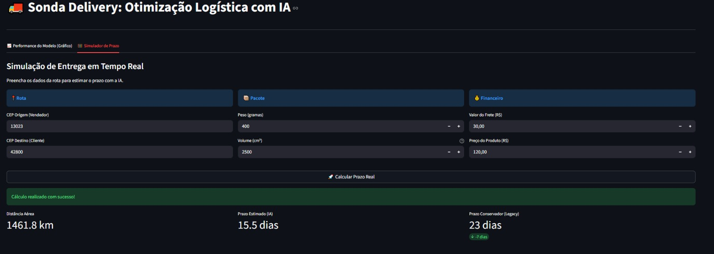
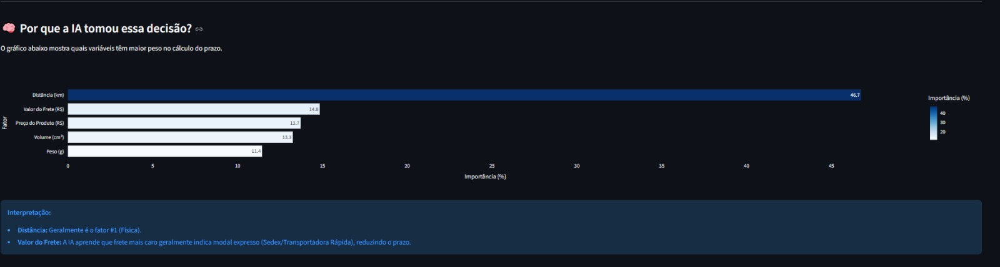
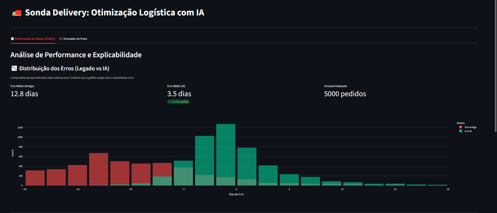
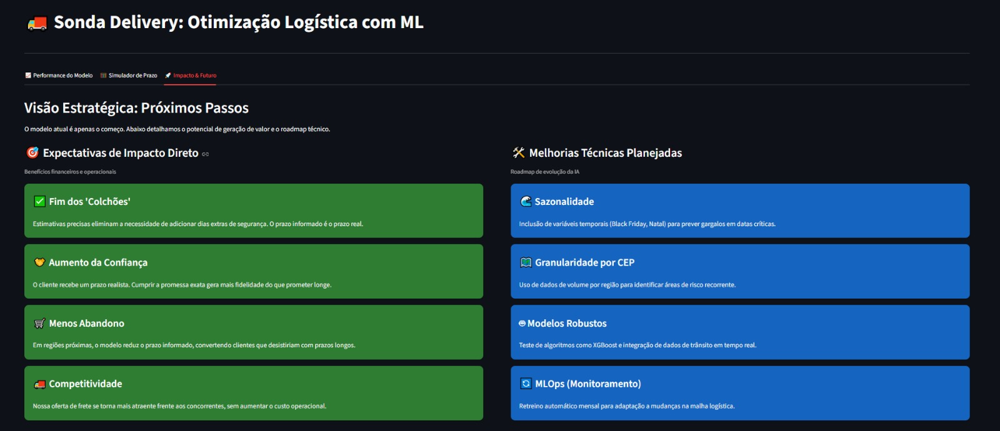

# 🚚 Predição Otimizada do Tempo de Frete (Olist E-commerce)

Este projeto implementa um modelo de Machine Learning (Regressão) para prever com maior precisão o tempo de entrega de pedidos, otimizando a logística e melhorando a experiência do cliente ao fornecer prazos mais realistas.

## 🎯 Objetivo do Projeto

O objetivo principal era criar um modelo de predição capaz de superar a estimativa de prazo padrão do e-commerce, focando em:

* **Melhoria na Precisão:** Reduzir o erro médio absoluto (MAE) na previsão do tempo de entrega.
* **Feature Engineering:** Utilizar dados geográficos e logísticos para criar variáveis preditivas robustas.
* **Qualidade do Serviço:** Oferecer prazos de entrega mais confiáveis ao cliente final.

---

## 💻 Metodologia e Pipeline

O projeto foi desenvolvido em Python, utilizando a biblioteca Pandas para manipulação de dados e o **Random Forest Regressor** para o treinamento do modelo preditivo.

### 1. Fonte de Dados
* **Dataset:** Base de dados públicos de e-commerce da Olist (OLITS).
* **Target (Variável Alvo):** Dias reais de entrega (`dias_reais`), calculados pela diferença entre a data de compra e a data de entrega ao cliente.

### 2. Feature Engineering (Destaque Principal)

A performance do modelo foi significativamente melhorada pela criação de features logísticas e geográficas essenciais:

* **Distância Haversine:** Calculada a distância real (em quilômetros) entre a latitude/longitude do CEP do vendedor e a latitude/longitude do CEP do cliente. Essa é uma *proxy* crucial para o custo e tempo de frete.
* **Volume do Produto:** Calculado em centímetros cúbicos (`product_length_cm` * `product_height_cm` * `product_width_cm`), sendo uma *proxy* para o espaço ocupado no transporte.
* **Features de Custo:** Utilização dos valores de frete (`freight_value`) e preço do produto (`price`).

### 3. Tratamento de Outliers (Mundo Eficiente)

Para garantir que o modelo previsse um prazo "eficiente", foi aplicado um filtro estatístico e temporal:

* Foram excluídos os 10% de pedidos com os maiores prazos de entrega, além da remoção de períodos atípicos (ex: greves nacionais).
* O treinamento final utilizou apenas dados considerados logisticamente **viáveis e eficientes**.

---

## 📊 Resultados e Conclusão

O modelo de Regressão Random Forest treinado nos dados limpos e com features engenheiradas demonstrou a seguinte performance:

* **Métrica Utilizada:** **Mean Absolute Error (MAE)**.
* **MAE Final:** **3.5 dias** (O modelo erra, em média, em 3.5 dias a previsão).

O arquivo **`data/comparativo_modelo.csv`** contém uma amostra de 5.000 previsões, comparando o prazo real, a estimativa antiga da plataforma e a previsão gerada por este modelo de IA.

---

## 🚀 Demonstração do Projeto (Streamlit)

O projeto inclui um aplicativo web (`app.py`) construído com Streamlit para demonstrar a predição em tempo real e visualizar os resultados e a performance do modelo de forma interativa.

#### 1. Interface de Predição e Simulação

A aplicação permite a inserção dos parâmetros logísticos (Peso, Volume, Distância e Preço) para gerar instantaneamente a estimativa de prazo do modelo Random Forest, servindo como um simulador.

**Simulador de Frete em Tempo Real:**

#### 2. Análise de Desempenho e Comparação

A aplicação exibe gráficos essenciais que comprovam a melhoria do modelo de ML em relação aos métodos tradicionais.

**Gráfico Comparativo do Modelo (Real vs. Estimativas):**

**Análise da Distribuição de Erros (Resíduos):**

#### 3. Conclusão e Próximos Passos

O painel conclui com o resultado final do MAE e sugere os próximos passos para a evolução da solução em um ambiente de produção.

**Conclusão e Próximos Passos Sugeridos:**

### Como Rodar a Demonstração

Para executar a demonstração localmente:
1.  Instale o Streamlit e outras dependências:
    `pip install streamlit pandas joblib scikit-learn`
2.  Execute o arquivo `app.py` na raiz do projeto:
    `streamlit run app.py`

## 🛠️ Estrutura do Repositório
/projetointegrador-frete-predição
├── app.py              <-- Script Streamlit (Code)
├── notebooks/          <-- Notebooks (Exploration/Code)
├── assets/             <-- Imagens/Screenshots (Assets)
├── data/               <-- Dados (Data)
├── model/             <-- Modelo Treinado (Artifacts)
└── README.md